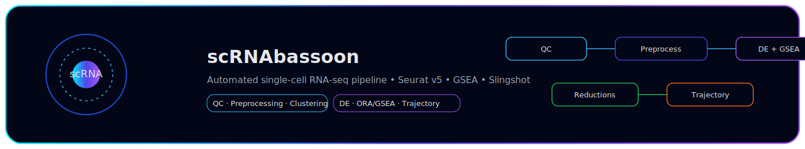
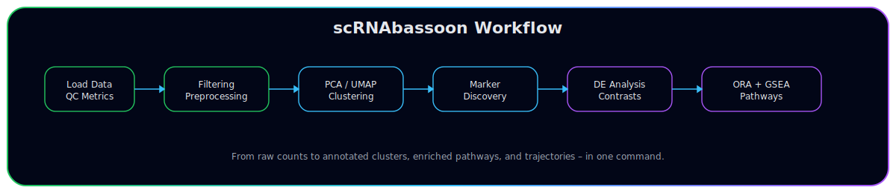
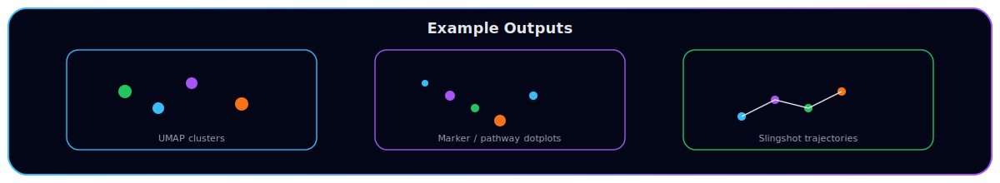

# 📦 **scRNAbassoon**  

### *A Next‑Generation, Fully Automated scRNA‑seq Analysis Pipeline (Seurat v5, ORA/GSEA, Slingshot)*  

<p align="center">
  
</p>

---

## 🚀 Overview
**scRNAbassoon** is an R package providing a **complete, automated, and reproducible single‑cell RNA‑seq pipeline**, built on top of:
- **Seurat v5** (QC, preprocessing, clustering, visualization)  
- **Slingshot** (trajectory inference & pseudotime)  
- **Custom ORA/GSEA modules** (GO, KEGG, Reactome)  
- **High‑quality graphics** using ggplot2 with custom futuristic themes  

The package is designed to help researchers rapidly process large-scale scRNA‑seq datasets while producing **publication‑ready plots**, **clean output structures**, and **fully documented R workflows**.

This version includes:
- Multi-sample QC and reduction plots  
- Automated DE analysis + volcano & ranked plots  
- Marker-based annotation (with built-in mouse panel)  
- Enrichment analysis (ORA + GSEA)  
- Lineage + pseudotime inference  
- Automatic ZIP bundle export for full reproducibility  
- A complete vignette walking through an example dataset  

---

## 📥 Installation
```r
# install.packages("remotes")
remotes::install_github("ebareke/scRNAbassoon")
```

---

## ⚡ Quick Start
```r
library(scRNAbassoon)

# Load raw 10X or Seurat object
seu <- load_sc_data("path/to/data/")

# Run full pipeline
d <- run_bassoon_pipeline(
  seu,
  organism = "mouse",
  output_dir = "analysis_out/",
  n_cores = 8
)
```

---

## 🛰️ **Workflow Overview**
<p align="center">
  
</p>

A typical `run_bassoon_pipeline()` run performs:

1. **Directory setup** → `/output/`  
2. **QC** → mitochondrial/ribosomal filtering, stats, violin plots  
3. **Preprocessing** → Normalize, scale, variable features, regressions  
4. **Reductions** → PCA, UMAP, tSNE (global & per-sample)  
5. **Clustering** → Leiden/Louvain + marker discovery  
6. **Annotation** → Marker-based automatic label assignment  
7. **DE Analysis** → Volcano plots, ranked tables  
8. **ORA + GSEA** → GO/KEGG/Reactome enrichment  
9. **Trajectory Inference** → Slingshot (lineages + pseudotime curves)  
10. **ZIP Bundle Export** → reproducible report structure  

---

## 🧬 Core Functions
The package exposes the following main user-facing functions:

| Function | Description |
|---------|-------------|
| `load_sc_data()` | Load 10X or an existing Seurat object |
| `run_qc()` | Automated QC metrics, thresholds, violin plots |
| `preprocess_data()` | Normalization, scaling, HVG selection |
| `plot_global_reductions()` | Global UMAP/tSNE/PCA |
| `plot_per_sample()` | Per-sample embeddings |
| `find_and_plot_markers()` | Cluster marker discovery |
| `annotate_by_markers()` | Automatic cluster annotation |
| `run_de_analysis()` | Differential expression + volcano plots |
| `run_enrichment_internal()` | Hidden ORA/GSEA engine |
| `run_trajectory_analysis()` | Slingshot pseudotime + branches |
| `create_zip_bundle()` | Export structured results |
| `run_bassoon_pipeline()` | Full automated pipeline |

---

## 🔬 **Example Outputs**
<p align="center">
  
</p>

### ✨ Included Output Types
- **UMAP / tSNE** global clustering  
- **Cell-type annotation** dotplots  
- **Per-sample reductions** to check batch effects  
- **Marker-based annotation** (dotplot, heatmap)  
- **DE volcano plots** with labeled significant genes  
- **ORA & GSEA** dotplots and ranked enrichment tables  
- **Slingshot trajectory**: 2D + 3D embeddings with lineage curves  
- **Full ZIP bundle** (plots, tables, R objects)  

---

## 📘 Vignette
The fully annotated tutorial is available with:
```r
vignette("scRNAbassoon")
```

The vignette includes:
- Full QC example  
- GEX dataset loading  
- Clustering & annotation walkthrough  
- DE analysis + enrichment interpretation  
- Trajectory inference example  
- Explanation of all output folders  

---

## 📂 Package Structure
```
scRNAbassoon/
├── R/                   # Pipeline modules
├── man/                 # Rd documentation
├── inst/run_bassoon.R  # Command-line wrapper
├── vignettes/          # Full tutorial
├── docs/               # SVG banners + website assets
├── DESCRIPTION
└── NAMESPACE
```

---

## 🛠 System Requirements
- **R ≥ 4.3**  
- **Seurat ≥ 5.0.0**  
- **Slingshot ≥ 2.6**  
- **Memory**: 16 GB (small datasets) → 64+ GB recommended for large projects  
- **Parallel Support**: Built-in multicore support via `future`  

---

## 👥 Authors
- **Eric Bareke** — Author & Maintainer  
- Contributions welcome via GitHub pull requests  

---

## 🧭 Roadmap
- [ ] Add automated cluster label transfer via scMAP  
- [ ] Add interactive Shiny QC dashboard  
- [ ] Add GPU-accelerated UMAP option  
- [ ] Add support for multi-modal scRNA + ATAC  
- [ ] Add pathway activity scoring module (AUCell / Viper)  

---

## ⭐ Contributions
If you want to contribute, report bugs, or request features:
👉 https://github.com/ebareke/scRNAbassoon

